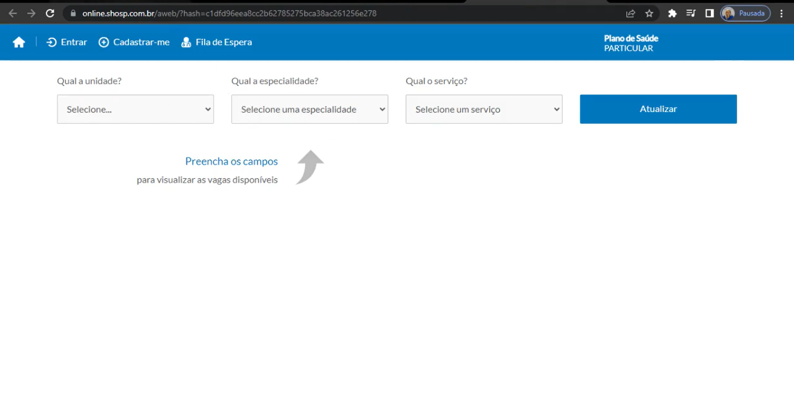
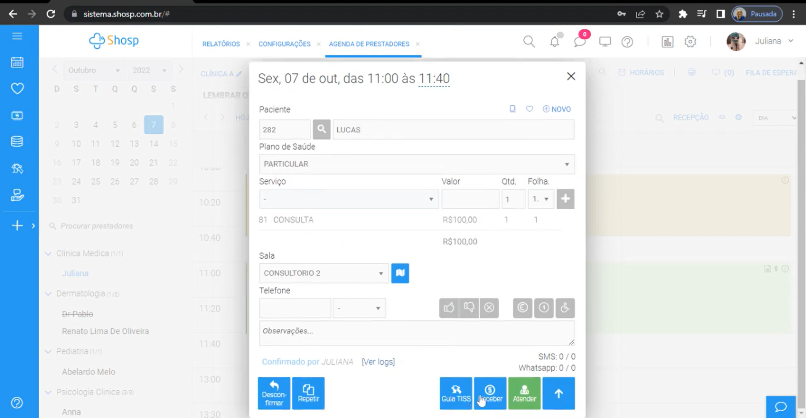
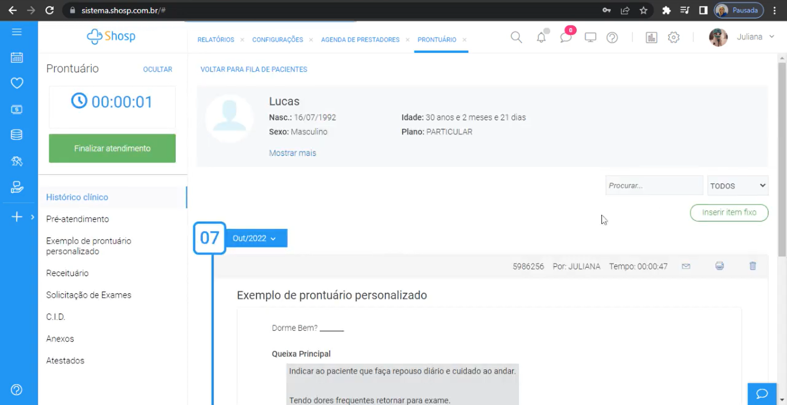
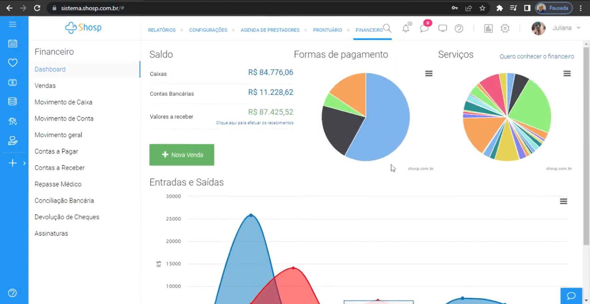
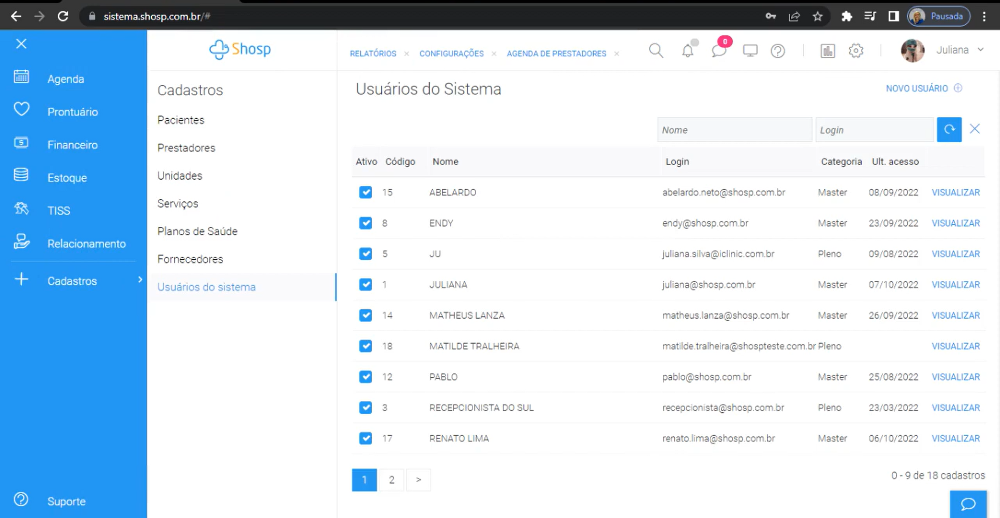
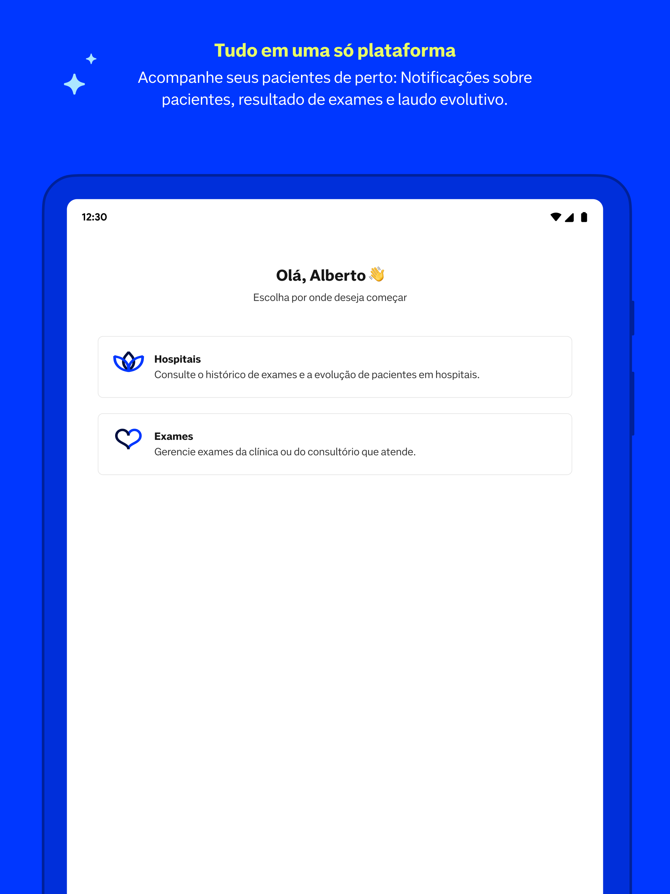
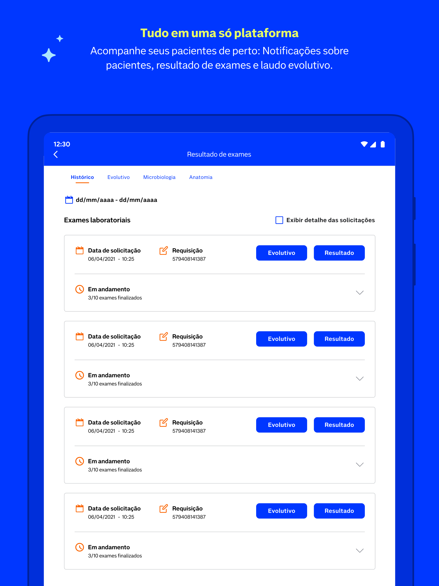
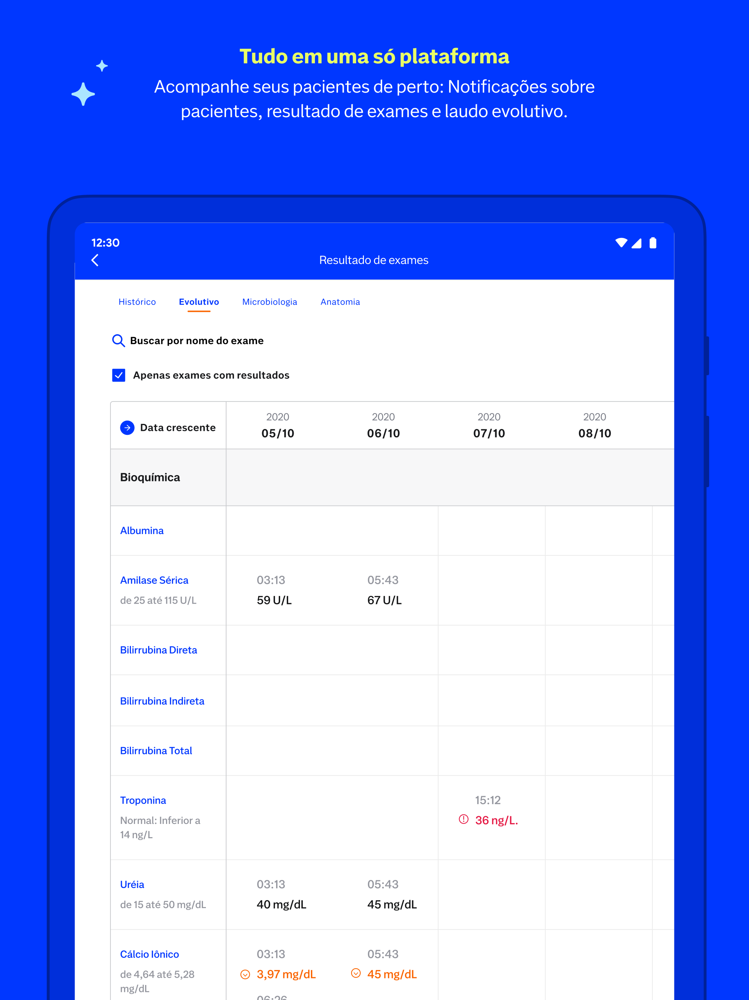

# Entrega 2 — Público-alvo e análise de concorrência

**Data:** 30/08/2026  
**Status:** 🟩 concluída  
**Responsabilidade mínima:** cada integrante analisa pelo menos 1 concorrente/interface representativa; a equipe produz síntese comparativa.

## Objetivo da atividade

Compreender soluções do mesmo domínio **e também interfaces familiares ao público-alvo**. O objetivo não é copiar telas, mas identificar convenções, padrões, affordances percebidas, problemas recorrentes, expectativas e oportunidades de design.

> **Concorrente não precisa ser idêntico ao produto.** Pode atuar na mesma área, resolver objetivo semelhante ou disputar a mesma necessidade. Quando não houver concorrente direto, use produtos análogos e softwares que o público já utiliza.

### Para TCCs que não previam interface

Não procure apenas um “concorrente do algoritmo”. Investigue **interfaces profissionais que materializam atividades semelhantes** às que o usuário escolhido precisaria realizar.

Exemplos:

- TCC de banco de dados → consoles de administração, ferramentas para DBA, monitoramento e análise de consultas;
- TCC de LLM/ML → painéis de experimentos, gestão de modelos/datasets, comparação de métricas, revisão de resultados;
- TCC de análise de dados → dashboards, ferramentas de BI, filtros, relatórios e exploração;
- TCC de infraestrutura/API → portais administrativos, observabilidade, logs, gestão de credenciais e uso;
- TCC de cibersegurança → consoles de alertas, triagem, histórico e auditoria.

A pergunta é: **“que convenções esse perfil já conhece para executar tarefas equivalentes?”**

## Entrada obrigatória da Entrega 1

Retome o mapa inicial de alternativas e produtos citado na Entrega 1. Aqui a equipe deixa de trabalhar apenas com impressão inicial e passa a **investigar sistematicamente** cada solução.

| Item citado na Entrega 1 | Tipo | Por que foi citado | Status inicial | Decisão nesta entrega |
|---|---|---|---|---|
| Sistemas médicos | ferramenta cotidiana | Não havia citado um produto específico, apenas o uso de ferramentas cotidianas | ? | analisar |

Se uma hipótese da Entrega 1 for confirmada ou refutada durante esta análise, atualize `H01`, `H02`... em [`../RASTREABILIDADE.md`](../RASTREABILIDADE.md).

## 1. Público-alvo desta análise

O público alvo da análise são médicos que utilizam softwares de gestão clínica como ferramenta cotidiana.

## 2. Concorrentes diretos/indiretos

### Análise C01 — Shosp

**Autor(a):** Mariane S. Carvalho - 22.123.105-3  
**Tipo:** software que o público utiliza  
**Link oficial:** [Shosp](https://www.shosp.com.br/)  
**Data de acesso:** 01/09/2026

#### Contexto e proposta

Segundo a marca, é um software médico completo e intuitivo com todas as funcionalidades necessárias para gerir e otimizar os processos de uma clínica médica.

#### Funcionalidades relevantes

| Funcionalidade | Como é realizada | Evidência/print | Observação de IHC |
|---|---|---|---|
| Login | Através de email e senha, ou via conta Google. |  | A autenticação oferece duas vias de acesso (email/senha e Google), reduzindo atrito para usuários já habituados com serviços digitais. O destaque visual do botão principal facilita a ação principal, embora mensagens de erro mais explícitas e recuperação de conta sejam importantes para evitar frustração em caso de falha. |
| Agendamento online | Paciente preenche informações de unidade, especialidade e serviço para visualizar a disponibilidade. |  | O fluxo guiado por etapas e a seleção de disponibilidade antes do cadastro ajudam a reduzir incertezas. A interface usa filtros por unidade, especialidade e calendário, o que é compatível com padrões de agendamento e torna a tarefa rápida e compreensível para o público. |
| Agendamento | Pessoa responsável pelo agendamento seleciona o profissional, dia e horário desejados, e preenche as informações do paciente. |  | A divisão em etapas (profissional, data/horário e dados do paciente) organiza bem a tarefa e reduz carga cognitiva. O uso de seleção direta e campos estruturados favorece eficiência, mas a quantidade de informações exige boa hierarquia visual para evitar erros de preenchimento. |
| Prontuário | Usuários conseguem acessar todas as informações referente à um atendimento (receituário, solicitação de exames, atestados, etc.).  |  | O prontuário centraliza informações do atendimento em um único local, facilitando a consulta em contexto clínico. A separação por módulos (receituário, exames, atestados) ajuda a organização, porém a densidade de dados pode gerar sobrecarga visual se não houver filtros e agrupamentos claros. |
| Financeiro | Usuários têm acesso à informações financeiras (movimentos, contas a pagar/receber, repasses, conciliações bancárias, etc.). |  | A interface evidencia dados financeiros em blocos e listas, o que é útil para acompanhamento operacional. A estrutura por categorias facilita a leitura e a navegação, mas telas muito densas podem exigir maior esforço de interpretação e treinamento do usuário. |
| Cadastro | Possibilida o gerenciamento de pacientes, prestadores, unidades, serviços, usuários do sistema, etc. |  | O cadastro organiza a gestão em módulos específicos (pacientes, prestadores, serviços, usuários), o que favorece escala e manutenção. A estrutura de formulários e listagens é funcional e compreensível, mas exige boa validação de campos e clareza visual para evitar falhas em operações frequentes. |

#### Experiência do usuário e opiniões

1. Depoimento no site do produto:
    - _"A agenda do sistema Shosp ajuda na organização do dia a dia, permitindo uma melhor visão e gestão da clínica. O software médico permite planejar ações de aperfeiçoamento nos meses seguintes baseado nos indicadores de atendimento, faltas e desmarcações."_

2. Avaliações no google:
    - _"O sistema é bom porém o suporte é muito ruim, muitas oscilações e não conseguimos contato horário nenhum. Fora que não tem suporte 24hrs. Parece que estamos a deriva."_
    - _"Sistema instável e suporte inexistente.Trabalhamos com a Shosp há anos, mas atualmente o serviço está péssimo! Hoje 2ª feira muito trabalho para fazer, sao 8:25h e, nada de suporte, nada de ajuda por parte dA Shosp! Um Show de horror! (...)"_
    - _"Não indico para ninguém! Já foi um sistema bom, não sei o que aconteceu mas quase todo dia uma instabilidade no sistema, erros que reportamos e já cheguei a esperar um mês por uma solução, isso não existe! Todo dia tendo que chamar um consultor para reportar algo, é desgastante isso."_

#### Preço/modelo de negócio

Plano mensal por prestador a partir de R$149.

#### Padrões e tendências percebidos

1. Padrões visuais
    - Predominância de azul e branco, transmitindo uma sensação de tecnologia, confiança e organização.
    - Verde é utilizado principalmente para ações positivas ou de confirmação, como “Atender”, “Finalizar atendimento” e “Nova Venda”.
    - Ícones são utilizados de forma recorrente para representar funcionalidades.
    - Tipografia simples e interface relativamente limpa.
    - O sistema utiliza diferentes áreas funcionais: agenda, prontuário, financeiro, relatórios etc.
    - As informações são organizadas em painéis, menus laterais, abas e blocos de conteúdo.

2. Padrões de navegação e interação
    Na aplicação administrativa, o menu vertical à esquerda concentra as principais funcionalidades. Isso facilita o acesso rápido a módulos diferentes sem precisar retornar à página inicial. Esse padrão é típico de sistemas ERP, CRM e sistemas de gestão hospitalar/clínica.

    Na parte superior aparecem abas como:

    >RELATÓRIOS → CONFIGURAÇÕES → AGENDA DE PRESTADORES → PRONTUÁRIO → FINANCEIRO

    Isso sugere uma interface que permite ao usuário trabalhar com várias áreas simultaneamente, mantendo o contexto das tarefas abertas.

3. Principais tendências observadas
    - Digitalização do atendimento (agendamento online).
    - Omnichannel (integração com Whatsapp).
    - Data-driven (Dashboards, relatórios e gráficos financeiros).
    - Centralização da gestão (Agenda + prontuário + financeiro + relatórios no mesmo sistema)

#### Pontos positivos, limitações e lições

| Ponto | Evidência | Implicação para nosso projeto |
|---|---|---|
| Boa organização por módulos |  | Ter um menu lateral e abas podem facilitar a localização das funcionalidades e deixar clara a divisão entre os diferentes processos. |
| Interface visual consistente |  | A utilização recorrente de cores e ícones pode ajudar a criar uma identidade visual relativamente uniforme. |
| Excesso de informações |  | Evitar telas com muitos menus, ícones, botões e informações simultaneamente. Para um usuário novo, isso pode gerar uma curva de aprendizado maior. |
| Separação de funcionalidades |  | Manter uma grande quantidade de funcionalidades disponíveis por tema pode fazer com que o usuário precise aprender muitos caminhos diferentes para executar suas tarefas, como por exemplo a configuração de um prontuário personalizado que poderia ser feito numa área de configuração.  |

> Repita a subseção para C02, C03... até atender à quantidade da equipe.

## 3. Softwares que o público-alvo usa no cotidiano

Analise interfaces que moldam a expectativa do público, mesmo que não sejam concorrentes.

| Software | Por que o público usa | Padrões relevantes | Prints | O que aprender |
|---|---|---|---|---|
| Nav Pro | Acompanhar e visualizar resultado de exames | Utilização de cores comumente utilizadas em sistemas médicos, utilização de ícones, separação por categorias, interface simples e intuitiva com informações relevantes, navegação por abas.  |    | Manter uma interface simples e objetiva, que forneça ao usuário uma jornada amigável. |

## 3.1 Padrões de interface relevantes ao escopo de IHC

Registre somente padrões encontrados nas soluções analisadas e que possam ter relação com objetivos reais da equipe.

| Padrão observado | Produto(s) | Para qual tarefa serve | Vantagem percebida | Risco/limitação | Aplicável ao nosso escopo? |
|---|---|---|---|---|---|
| dashboard | - | - | - | - | não |
| relatório | - | - | - | - | não |
| histórico + filtros | Shosp, Nav Pro | Consultar o histórico de um paciente específico | Permite ao usuário alvo ter acesso à análises pré existentes | Armazenamento das análises, dado que a saída esperada é a visualização 3d da tomografia com interpretabilidade aplicada. | talvez |
| administração/CRUD | Shosp, Nav Pro | Separação de perfis de usuários | A criação de perfis distintos permite gerenciar tipos de acesso | No momento não sei se é aplicável ao projeto. | talvez |
| comparação de resultados | - | - | - | - | não |

> O objetivo não é concluir “todo concorrente tem dashboard, então teremos um”. O padrão só será adotado se apoiar uma tarefa rastreável.

## 4. Síntese comparativa da equipe

| Critério | C01 | C02 | C03 | Oportunidade para o projeto |
|---|---|---|---|---|
| Navegação | Menu lateral e abas organizam bem os módulos; acesso rápido entre agenda, prontuário e financeiro, mas há muitos caminhos e níveis de profundidade. |  |  | Usar menu lateral e abas apenas para módulos principais, com profundidade controlada e atalhos para tarefas frequentes. |
| Feedback/estado | Usa cores e ícones para indicar ações e estados; porém o sistema pode parecer pouco transparente em falhas e instabilidades. |  |  | Priorizar indicadores visuais claros para ações e erros, sem depender apenas de cores; incluir mensagens explícitas de falha e confirmação. |
| Prevenção/recuperação de erro | Fluxos em etapas e campos estruturados ajudam a reduzir erros; faltam mensagens mais explícitas e recuperação clara em casos de falha. |  |  | Adotar fluxos em etapas e validação contextual, com recuperação clara e mensagens de erro legíveis. |
| Terminologia | Linguagem profissional e adequada ao contexto clínico/administrativo, mas pode ser densa para usuários menos experientes. |  |  | Usar linguagem clara e profissional, adaptada ao contexto clínico, sem excesso de jargão. |
| Acessibilidade | Organização visual e contraste simples favorecem leitura, mas a densidade de informações e a grande quantidade de ações podem dificultar uso em telas complexas. |  |  | Manter contraste, hierarquia visual e reduzir densidade informacional em telas centrais para facilitar leitura e uso. |
| Eficiência | Alta eficiência para tarefas recorrentes e gestão operacional; o processo é rápido, mas exige treinamento para navegar sem sobrecarga cognitiva. |  |  | Otimizar tarefas recorrentes com filtros, atalhos e organização por contexto, sem sobrecarregar o usuário. |

## 5. Recomendações derivadas

- **RC01:** Priorizar um menu lateral com poucos módulos principais e atalhos para tarefas frequentes - derivada de C01 (Shosp), especialmente na organização de agenda, prontuário e financeiro.
- **RC02:** Incluir mensagens de erro e confirmação claras, sem depender apenas da cor - derivada de C01 (feedback/estado e da criticidade de instabilidade reportada pelos usuários).
- **RC03:** Manter linguagem profissional, mas simples e consistente com o contexto clínico - derivada de C01 (terminologia e densidade de informação).
- **RC04:** Reduzir densidade visual em telas centrais e manter hierarquia clara para informações críticas - derivada de C01 (prontuário e financeiro).
- **RC05:** Garantir filtros e histórico de consultas para facilitar retomada de contexto e comparação de casos - derivada de C01 e do padrão “histórico + filtros” observado em Shosp e Nav Pro.
- **RC06:** Oferecer visão resumida de status e ações principais por contexto, sem sobrecarregar o usuário - derivada de C01 e de convenções de sistemas médicos/profissionais.
- **RC07:** Separar claramente módulos de operação e configuração, evitando excesso de profundidade na navegação - derivada de C01, que apresenta grande quantidade de funcionalidades e caminhos.

## Referências

- Shosp: [Shosp](https://www.shosp.com.br/)
- Avaliações Shosp: [Google Shosp](https://www.google.com/search?q=shosp&sca_esv=97ecd86c81018411&rlz=1C1CHZN_enBR988BR988&sxsrf=APpeQnseGP1NEU5eJ3qKMBPHZanrb9ZEQw%3A1788802583374&ei=F_aeasaxFv7e1sQP5fbC0Qw&biw=1280&bih=593&ved=2ahUKEwiGmbj0gN2WAxV-r5UCHWW7MMoQ4dUDegQIBhAM&uact=5&oq=shosp&gs_lp=Egxnd3Mtd2l6LXNlcnAiBXNob3NwMgQQIxgnMgQQIxgnMgQQIxgnMgoQABiABBgUGIcCMgUQABiABDIFEAAYgAQyChAAGIAEGIoFGEMyBRAAGIAEMgUQABiABDIFEAAYgARIuARQuAJYuAJwAXgBkAEAmAGTAaABkwGqAQMwLjG4AQPIAQD4AQGYAgKgAp8BwgIKEAAYRxjWBBiwA8ICFxAuGNwGGLgGGNoGGNgCGMgDGLAD2AEBmAMAiAYBkAYIugYECAEYGZIHAzEuMaAH5AayBwMwLjG4B5sBwgcFMC4xLjHIBwmACAE&sclient=gws-wiz-serp#lrd=0x935ef15e596c7a0f:0xe97675e9eadc0a5f,1,,,,)
- Conheça o Sistema Shosp: [Demo](https://www.youtube.com/watch?v=o45d1eBKSM8)
- Nav Pro: [Nav Pro](https://navpro.dasa.com.br/)
- Nav Pro Google Play: [App Nav Pro](https://play.google.com/store/apps/details?id=br.com.dasa.hospitais.patientmonitor&hl=pt_BR)

## Checklist

- [x] O mapa inicial de alternativas da Entrega 1 foi revisitado e aprofundado.
- [x] Hipóteses relevantes sobre mercado/padrões foram atualizadas na rastreabilidade quando surgiram evidências.
- [x] Há pelo menos uma análise completa por integrante.
- [x] Cada análise contém prints legíveis da interface.
- [x] Prints mostram telas/estados relevantes, não apenas logos/homepage.
- [x] Foram analisados concorrentes e/ou interfaces representativas ao público.
- [ ] Em TCC sem interface original, foram investigadas ferramentas profissionais análogas às atividades do usuário escolhido.
- [x] Padrões como dashboard, relatório, filtros e CRUD foram analisados como soluções para tarefas, não como requisitos automáticos.
- [x] Opiniões de UX têm fonte.
- [x] A síntese compara critérios comuns e produz recomendações.
- [x] Não há “copiar porque o concorrente faz”; há justificativa de adequação ao público/contexto.
