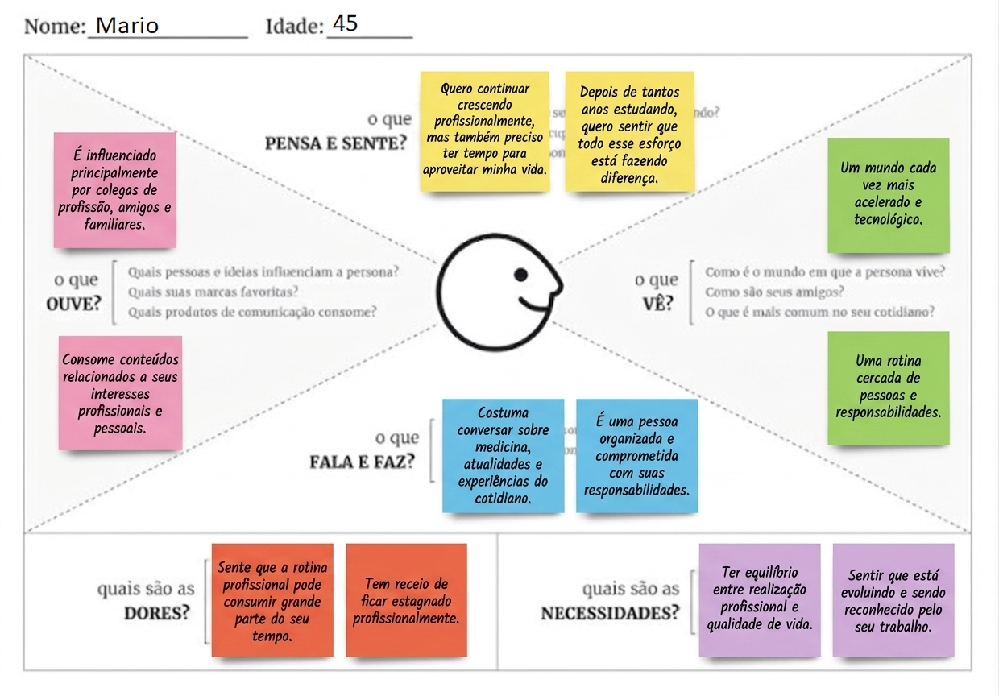

# Entrega 3 - Personas, mapa de empatia, contexto de uso e jornada

**Data:** 07/09/2026  
**Status:** 🟩 concluída  
**Responsabilidade:** 1 persona por integrante; 1 mapa de empatia, 1 contexto de uso consolidado e 1 jornada por equipe (salvo orientação diferente do docente).

## Objetivo da atividade

Representar grupos de usuários de forma útil para decisões de design. Persona não é personagem decorativo: suas características devem alterar requisitos, prioridades, linguagem, fluxos ou critérios de avaliação.

## Atenção a projetos técnicos

Em TCCs sem interface original, a persona pode representar um **profissional que se apropria da contribuição técnica**: DBA, analista, cientista de dados, administrador, pesquisador, técnico, operador, gestor ou especialista de domínio.

Não escolha um perfil apenas porque “parece combinar” com a tecnologia. Explique **qual objetivo esse perfil teria e qual parte da contribuição do TCC produziria valor para ele**. Se ainda for hipótese, mantenha como hipótese/proto-persona a validar.

Também considere papéis diferentes quando houver tarefas distintas, por exemplo:

- operador que executa análises;
- administrador que configura e gerencia permissões;
- especialista que interpreta resultados;
- gestor que consulta relatórios e decide;
- auditor que revisa histórico.

## Entradas da Entrega 1

Antes de criar personas, retome os tipos de usuários, características relevantes, objetivos e hipóteses registradas na Entrega 1. A persona **não deve transformar uma hipótese inicial em fato por meio de uma história fictícia**.

| Item da Entrega 1 | Status inicial | Evidência disponível agora | Como será tratado nesta entrega |
|---|---|---|---|
| Usuário direto/beneficiário | H | A Entrega 1 indica “Médicos” como usuários diretos e menciona o perfil de “médico radiologista ou especialista responsável pelo diagnóstico”; o TCC também aponta valor para avaliação clínica de tomografias renais. | Incorporar como persona primária, com foco em médico especialista que interpreta exames renais. |
| Objetivo principal do usuário | F | A Entrega 1 registra que o usuário busca “obter auxílio diagnóstico de patologias renais em estágios iniciais”, e o TCC reforça a necessidade de apoiar a avaliação de tomografias para detectar alterações precoces. | Incorporar como objetivo central da persona e orientar tarefas, dores e jornada. |
| Característica relevante: conhecimento clínico e baixa familiaridade com ML | H | A Entrega 1 afirma que o médico tem familiaridade com sistemas de exames, mas pode não conhecer métricas de aprendizado de máquina; o problema de explicabilidade também aparece como ponto crítico. | Incorporar como característica, necessidade e restrição de design da persona. |
| H01 - explicação do modelo aumenta confiança e uso | H | A hipótese indica que médicos considerarão útil uma explicação do resultado junto à imagem, e a análise do problema destaca a necessidade de interpretar a indicação do modelo para decidir a conduta clínica. | Manter como hipótese-chave a validar na persona, no mapa de empatia e na jornada. |
| H02 - fluxo de upload, processamento e resultado é relevante no contexto profissional | H | A Entrega 1 identifica seleção e carregamento de exames, consulta à classificação e interpretação do resultado como atividades frequentes/altamente críticas. | Manter como hipótese relevante e consolidar no contexto de uso e na jornada do usuário. |
| H03 - médico distingue a indicação da IA do diagnóstico final | H | A Entrega 1 destaca responsabilidade profissional, necessidade de distinção entre predição e decisão médica e risco de interpretação incorreta do resultado. | Incorporar como requisito de clareza, governança e confiança no design da interface. |

## 1. Personas

### Persona P01 - Mário Russano

**Autor(a):** Mariane S. Carvalho  
**Tipo:** primária 
**Base de evidências:** proto-persona a validar  
**Hipóteses da Entrega 1 relacionadas:** H02

| Campo | Descrição |
|---|---|
| Faixa etária / contexto relevante | 45 anos, médico experiente, com rotina clínica intensa e necessidade de tomar decisões com agilidade. Atua principalmente no acompanhamento e diagnóstico de pacientes com doenças renais. |
| Ocupação/papel | Médico nefrologista, responsável pela avaliação clínica dos pacientes, interpretação de exames e definição de condutas. Pode atuar em hospital, clínica especializada ou centro de diagnóstico. |
| Conhecimento do domínio | Amplo conhecimento em nefrologia, doenças renais e interpretação de exames relacionados aos rins. Possui experiência para avaliar achados clínicos e imagéticos e confrontá-los com o histórico do paciente. |
| Experiência tecnológica | Intermediária/alta. Utiliza prontuários eletrônicos, sistemas hospitalares e plataformas de exames diariamente. Não necessariamente possui conhecimento técnico sobre IA ou CNNs, mas entende os resultados clínicos e espera que o sistema seja simples de utilizar.  |
| Objetivos | Aumentar a precisão e agilidade da avaliação, identificar possíveis alterações renais em imagens, reduzir o risco de passar despercebidos achados relevantes e utilizar informações adicionais para apoiar sua decisão clínica. |
| Necessidades | Receber resultados claros, rápidos e confiáveis; visualizar a imagem analisada; identificar a região que levou o sistema a sinalizar uma possível alteração; compreender o resultado de maneira objetiva; comparar o resultado da IA com sua própria avaliação. |
| Dores/frustrações | Grande volume de exames; jornada de trabalho exaustiva; possibilidade de alterações sutis passarem despercebidas; sistemas hospitalares complexos; resultados de IA que não explicam por que chegaram a determinada conclusão; receio de confiar em uma ferramenta sem compreender suas limitações. |
| Motivadores | Melhorar a qualidade do atendimento; reduzir erros de interpretação; ganhar tempo na análise; utilizar novas tecnologias de forma segura; ter maior confiança nas decisões clínicas e oferecer um diagnóstico mais consistente aos pacientes. |
| Restrições/acessibilidade | Possui pouco tempo para aprender sistemas novos. A interface deve exigir baixa carga cognitiva, apresentar informações de forma objetiva e utilizar textos, ícones e indicadores facilmente compreensíveis. Deve permitir boa visualização das imagens e dos resultados, inclusive em monitores hospitalares de diferentes tamanhos. |
| Ambiente típico de uso | Consultório, clínica ou hospital, geralmente em um computador de trabalho, durante a avaliação de exames de pacientes. Pode utilizar o sistema em momentos de alta demanda, com interrupções frequentes. |
| Comportamentos relevantes | Analisa primeiro as informações clínicas e os exames; tende a validar o resultado da ferramenta antes de utilizá-lo; procura evidências visuais para confirmar uma indicação da IA; prefere interfaces objetivas; compara diferentes informações antes de tomar uma decisão; tende a desconfiar de resultados que não apresentem justificativa ou evidência visual. |

**Decisões de design influenciadas por P01:**

- Resultado objetivo: apresentar a classificação de maneira clara, evitando excesso de informações técnicas.
- Explicabilidade: permitir visualizar onde o modelo concentrou sua atenção na imagem.
- Comparação: possibilitar visualizar a imagem original junto da indicação gerada pelo sistema.
- Confiança: apresentar métricas ou indicadores de confiança de maneira compreensível, sem transformar o sistema em uma “caixa-preta”.
- Agilidade: o fluxo para carregar/analisar uma imagem e visualizar o resultado deve ter poucos passos.
- Controle médico: deixar explícito que o resultado é apoio à decisão, cabendo ao médico a avaliação final.
- Baixa carga cognitiva: evitar dashboards excessivamente complexos ou informações técnicas de ML que não contribuam diretamente para a decisão.

> Repita para P02, P03... Cada integrante deve produzir ao menos uma persona.

### Síntese das personas

O médico nefrologista é a persona prioritária porque possui conhecimento especializado sobre doenças renais e é diretamente responsável pela interpretação dos resultados clínicos. Como o software tem a finalidade de auxiliar na identificação de alterações em imagens dos rins, é esse profissional que utilizará os resultados da ferramenta para complementar sua própria avaliação.

## 2. Mapa de empatia - equipe

**Persona escolhida:** P01  
**Justificativa:** porque representa o principal usuário do sistema e, consequentemente, a pessoa que mais influencia se a solução realmente cumpre seu objetivo de auxiliar o diagnóstico.

Documente também em texto: o que vê; ouve; diz/faz; pensa/sente; dores; ganhos. Diferencie **evidência** de **hipótese**.

## 3. Contexto de uso - consolidação

| Dimensão | Descrição | Implicação de design |
|---|---|---|
| Usuários | Nefrologistas são os usuários principais, com conhecimento médico especializado e experiência variável com tecnologias de IA. Outros profissionais, como radiologistas ou equipe médica, podem eventualmente consultar os resultados. | Interface voltada ao conhecimento médico, sem exigir conhecimento técnico de IA. Utilizar linguagem clínica clara e permitir diferentes níveis de acesso conforme o perfil. |
| Tarefas | Carregar/selecionar imagens, iniciar o processamento, visualizar a classificação, analisar regiões sinalizadas, comparar o resultado da IA com a imagem original e utilizar as informações como apoio à avaliação médica. | Fluxo curto e direto, com poucos passos. Destacar resultado, evidência visual e informações relevantes, evitando sobrecarga de dados. |
| Equipamentos | Computador utilizado no ambiente clínico, com monitor adequado para visualização de imagens médicas. | Interface responsiva à resolução do monitor, boa legibilidade e visualização ampliada das imagens. Controles de zoom e navegação devem ser simples. |
| Ambiente físico | Consultório, clínica, hospital ou centro de diagnóstico. O profissional pode trabalhar em períodos de alta demanda, com interrupções e pouco tempo disponível. | Priorizar velocidade, legibilidade e simplicidade. Informações importantes devem estar disponíveis sem exigir navegação excessiva. |
| Ambiente social/organizacional | O software está inserido em um contexto de saúde no qual os resultados podem ser discutidos ou validados por diferentes profissionais. A decisão final permanece associada à avaliação médica. | Deixar clara a distinção entre resultado do modelo e decisão profissional. Facilitar o compartilhamento/registro dos resultados quando aplicável. |
| Papéis/permissões/governança | O médico possui papel de avaliador e tomador de decisão clínica. O sistema atua como ferramenta de apoio e não deve substituir o julgamento profissional. | Apresentar resultados de forma transparente, registrar análises quando necessário e indicar limitações/incertezas do modelo. Diferenciar claramente predição da IA de conclusão médica. |
| Volume de dados/histórico | Pode haver grande quantidade de imagens e exames de diferentes pacientes, além de análises anteriores. O sistema precisa lidar com diferentes exames sem dificultar a localização do caso atual. | Oferecer identificação clara do paciente/exame, organização do histórico, busca e filtros. Evitar que informações de diferentes casos sejam confundidas. |

## 4. Jornada do usuário - equipe

**Persona:** P01  
**Objetivo da jornada:** Utilizar o software de processamento de imagens como apoio à análise de exames renais, obtendo uma classificação e evidências visuais que permitam ao médico validar o resultado.  
**Início e fim da jornada:** Inicia quando o médico precisa analisar uma imagem/exame renal e termina quando ele interpreta e valida o resultado apresentado pelo sistema, utilizando-o como informação complementar à sua avaliação clínica.

| Etapa | Situação/ação | Objetivo | Pensamento/emoção | Dor | Oportunidade de design | Evidência |
|---|---|---|---|---|---|---|
| 1 - Receber o exame | Mário recebe ou acessa o exame de imagem de um paciente. | Identificar o exame que precisa ser analisado. | “Preciso avaliar esse exame e verificar se há alguma alteração.” - Concentrado / pressionado pelo tempo. | Grande volume de exames e pouco tempo disponível. | Facilitar acesso e identificação do exame, com informações claras do paciente e do estudo. | [H] volume de exames e pressão de tempo fazem parte da rotina clínica. |
| 2 - Selecionar a imagem | Localiza e seleciona as imagens que serão analisadas pelo sistema. | Enviar o exame correto para processamento. | “Preciso ter certeza de que estou analisando o exame correto.” - Atento. | Risco de selecionar uma imagem ou exame incorreto. | Exibir identificação clara do paciente, exame e data antes do processamento. | [F] identificação correta do exame é necessária em ambientes clínicos. |
| 3 - Processar imagens | Solicita ao sistema a análise da imagem. | Obter uma avaliação automatizada. | “Espero que a análise seja rápida.” - Expectativa / curiosidade. | Espera ou processos com muitas etapas podem interromper o fluxo de trabalho. | Feedback visual de processamento e indicação clara do estado da análise. | [H] rapidez e feedback são importantes para adoção da ferramenta. |
| 4 - Visualizar o resultado | O sistema apresenta a classificação gerada pelo modelo. | Identificar se o exame apresenta indícios de alteração. | “O sistema identificou alguma alteração?” - Atento / cauteloso. | Uma classificação isolada pode ser insuficiente para gerar confiança. | Destacar o resultado de forma objetiva, juntamente com indicadores de confiança e informações relevantes. | [F] profissionais precisam contextualizar a predição antes de utilizá-la. |
| 5 - Investigar a evidência | Mário visualiza a região da imagem destacada pelo sistema. | Entender quais características contribuíram para o resultado. | “Por que o sistema chegou a essa conclusão?” - Questionador. | Resultado do modelo pode parecer uma “caixa-preta”. | Enfatizar o uso de mapas de atenção/Grad-CAM sobre a imagem original para indicar as regiões relevantes. | [H] explicabilidade pode aumentar a compreensão e a confiança no resultado. |
| 6 - Comparar com sua avaliação | Compara a indicação do modelo com sua própria análise e demais informações disponíveis. | Validar ou questionar o resultado apresentado. | “Isso faz sentido considerando o que estou vendo?” - Crítico / analítico. | Possível divergência entre a avaliação médica e o modelo. | Permitir visualização lado a lado da imagem original e da evidência gerada pelo modelo. | [F] o médico deve manter o controle sobre a interpretação final. |
| 7 - Tomar uma decisão | Considera o resultado do sistema como informação complementar à avaliação clínica. | Incorporar ou desconsiderar a indicação do modelo. | “Vou considerar essa informação junto aos demais dados do paciente.” - Seguro / responsável. | Risco de interpretar a predição como diagnóstico definitivo. | Deixar explícito que o sistema fornece apoio à decisão, não substituição da avaliação médica. | [F] a decisão clínica permanece sob responsabilidade do profissional. |
| 8 - Encerrar/registrar análise | Finaliza a análise e, quando aplicável, registra ou consulta posteriormente o resultado. | Manter histórico e rastreabilidade da análise. | “Preciso conseguir recuperar essa informação depois.” - Objetivo. | Perder resultados ou dificultar sua recuperação. | Histórico organizado, identificação do exame e registro dos resultados das análises. | [H] rastreabilidade é relevante em sistemas utilizados no contexto clínico. |

> A jornada pode incluir etapas **antes, durante e depois** do uso do produto. Não transforme a jornada em lista de telas.

## Síntese

Quais necessidades e objetivos devem obrigatoriamente aparecer nos cenários e nas tarefas seguintes?

## Checklist

- [x] Existe pelo menos uma persona por integrante.
- [x] As personas não são apenas diferenças demográficas superficiais.
- [x] Está claro o que é dado real e o que é hipótese/proto-persona.
- [x] A persona não “validou por ficção” uma hipótese da Entrega 1; afirmações continuam marcadas como hipótese quando não há evidência.
- [x] Objetivos e dores têm consequência para o design.
- [x] Contexto de uso está coerente com a Entrega 1.
- [ ] Em TCC sem interface original, a persona possui relação explícita com a contribuição técnica.
- [x] Papéis administrativos, técnicos e decisórios só foram criados quando possuem objetivos/tarefas diferentes.
- [x] Jornada possui etapas, dores e oportunidades e não é apenas wireflow.
- [x] IDs das personas foram adicionados à rastreabilidade.
